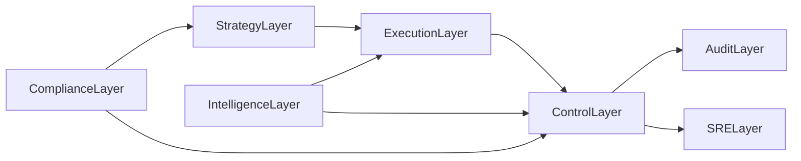

# 무인 회사 개발 계획서 (이상형) - 보완판 v1.2

## 문서 목적
- 기존 v1.0을 전면 재검토해, 실행 누락/모호한 기준/운영 공백을 제거한 실무형 계획서로 개정한다.
- 목표는 "좋은 방향성"이 아니라 "실패 확률이 낮은 운영 체계"다.

## 적용 범위
- 범위 포함: 자동매매 기반 수익 엔진, 운영 자동화, 감사/보안/복구 체계, 단계적 자율화.
- 범위 제외: 법률 자문 대체, 투자 성과 보장, 무제한 레버리지 전략.

---

## 1) v1.0 재분석 결과

## 강점
- 계층형 아키텍처와 단계적 자율화 로드맵이 명확하다.
- 통제/감사 우선 철학이 일관적이다.
- KPI를 재무/운영/리스크로 분리해 균형이 좋다.

## 문제점
- 다수 항목이 선언 수준이며 수치 기준(임계값/승인 조건)이 부족했다.
- 책임 주체가 명확하지 않아 실행 중 "누가 결정하는가"가 불분명했다.
- 배포/롤백/장애복구/감사 증적의 운영 절차가 문서화되지 않았다.
- 모델 품질/드리프트/데이터 품질에 대한 사전 차단 게이트가 약했다.

## 핵심 보완 방향
- 모든 제안은 반드시 `정책 + 임계값 + 담당자 + 증적` 형태로 명시한다.

---

## 2) 실패 가능성 높은 리스크 목록 (우선순위)

1. **컴플라이언스 미준수**
   - 국가/거래소별 기록보관, 세무, AML/KYC 요건 누락 시 운영 중단 가능.
2. **자본 관리 미흡**
   - 수익이 나도 리스크 예산 부재로 단기 급락에 계정 훼손 가능.
3. **복구 체계 부재**
   - 장애 대응이 ad-hoc이면 무인 운영이 아닌 무관리 운영이 된다.
4. **데이터/모델 품질 붕괴**
   - 품질 게이트 없는 자동매매는 오입력-오결정-오주문 연쇄를 만든다.
5. **보안 단일 실패점**
   - 키 탈취/권한 과다 부여 시 전 자산 및 로그 무결성 훼손 가능.
6. **감사 불충분**
   - 로그는 있어도 결정 근거가 없으면 규제/외부감사에 대응 불가.
7. **비용 통제 실패**
   - 관측/LLM 호출/스토리지 비용 상한 미설정 시 수익성 악화.
8. **자율화 과속**
   - 승인 체계 제거가 빠르면 예외처리 실패가 누적된다.

---

## 3) 보완 제안 (정책+기준+증적)

## A. 거버넌스/컴플라이언스
- 정책: 거래 대상별 규제 매트릭스 유지.
- 기준: 월 1회 점검, 분기 1회 외부 검토.
- 증적: `compliance_checklist_YYYYMM.md`, 위반건수 리포트.

## B. 자본/리스크 정책
- 정책:
  - 전략별 최대 노출 15% (초기), 계정 총합 노출 60% 상한.
  - 일손실 1.5%, 주간손실 4%, 월손실 8% 상한.
  - 1회 위반 시 노출 50% 축소, 2회 위반 시 페이퍼 모드 전환.
- 기준:
  - 증액은 4주 연속 KPI 통과 + MDD 기준 충족 시만 허용.
- 증적:
  - `risk_policy_events.log`, `capital_allocation_history.csv`.

## C. 운영 신뢰성 (SRE)
- 정책:
  - RTO 15분, RPO 1분.
  - 장애등급 SEV1/SEV2/SEV3 대응 플레이북 운영.
- 기준:
  - 월 1회 장애훈련(GameDay), 분기 1회 DR 훈련.
- 증적:
  - `incident_postmortem_*.md`, `dr_drill_report_*.md`.

## D. 모델/데이터 거버넌스
- 정책:
  - 데이터 품질 게이트 미통과 시 주문 차단.
  - 드리프트 임계치 초과 시 자동 격리 + canary 롤백.
- 기준:
  - 결측률, 지연률, 분포거리(PSI/KS) 임계치 운영.
- 증적:
  - `data_quality_daily.json`, `model_drift_alerts.log`.

## E. 보안/권한/비밀관리
- 정책:
  - 운영/개발/백테스트 계정 및 네트워크 분리.
  - 출금 권한 기본 금지, 최소권한 원칙.
  - 시크릿 30일 로테이션, 비정상 접근 탐지.
- 기준:
  - 월 1회 권한 감사, 분기 1회 침투 테스트.
- 증적:
  - `access_review_*.csv`, `secret_rotation_report_*.md`.

## F. 감사/설명가능성 표준
- 정책:
  - 주문 단위 필수 필드 강제:
    - `decision_id`, `strategy_id`, `input_snapshot_hash`, `risk_decision`, `reason_code`, `expected_slippage`, `final_action`
- 기준:
  - 의사결정 추적률 100%.
- 증적:
  - append-only 감사 로그 + 일/주/월 보고서.

## G. 비용 통제
- 정책:
  - 로그 보존: hot 30일, warm 90일, cold 365일.
  - LLM/인프라 일/주/월 예산 상한.
- 기준:
  - 월 손익 대비 운영비 비율 상한(예: 25%) 관리.
- 증적:
  - `cost_dashboard_export_*.csv`.

---

## 4) 아키텍처 (보완형)

- `ControlLayer`는 실행 허가권을 독점한다.
- `IntelligenceLayer`는 제안만 하고, 실행 권한은 없다.
- `ComplianceLayer`는 전략 승인/중단 권한을 가진다.

---

## 5) 역할/책임 체계 (RACI 간략)

- `CRO-Agent`: 리스크 정책 승인/집행 책임.
- `COO-Agent`: 운영 신뢰성, 장애대응 책임.
- `CFO-Agent`: 자본 배분, 비용 통제 책임.
- `Audit-Agent`: 감사 증적 무결성 책임.
- `Revenue-Agent`: 수익 실행 담당, 단독 실행권 없음.

핵심 규칙: `Revenue-Agent` 주문은 `RiskGuard` 승인 전송 없이는 전부 차단.

---

## 6) 단계별 실행 계획 (보완)

## 단계 A (0~8주): 감독형 자율
- 산출물:
  - 리스크 엔진, 감사 스키마, 장애 플레이북, 규제 체크리스트 v1.
- 통과 기준:
  - 7일 무중단, 손실 상한 위반 0건, RTO 준수율 95% 이상.

## 단계 B (2~4개월): 제한형 자율
- 산출물:
  - 증액/감액 자동 정책, 드리프트 격리, 감사 자동리포트.
- 통과 기준:
  - 8주 연속 KPI 통과, 드리프트 처리 성공률 95% 이상.

## 단계 C (4~12개월): 완전자율 + 다중 수익원
- 산출물:
  - 수익원 다각화, 동적 자본 배분, 외부감사 대응 패키지.
- 통과 기준:
  - 분기 순이익 안정성 + 컴플라이언스 이슈 0건.

---

## 7) 프로덕션 승인 게이트 (수치형)

- 성능:
  - Sharpe >= 1.2, MDD <= 15%, WinRate >= 52%.
- 리스크:
  - 일/주/월 손실 한도 위반 0건.
- 안정성:
  - p99 처리지연 <= 5ms, 자동복구 성공률 >= 95%.
- 감사:
  - 주문/의사결정 추적률 100%, 로그 무결성 검증 통과.
- 보안:
  - 키 로테이션/권한점검/이상접근 탐지 모두 통과.

모든 항목 통과 전 실거래 증액 금지.

---

## 8) 배포/롤백/변경관리 기준

- 배포 순서: `shadow -> canary(10%) -> full`.
- 롤백 조건:
  - MDD 급증, 오류율 임계 초과, 드리프트 경보 발생 시 즉시 롤백.
- 변경관리:
  - 정책/전략/모델 변경은 변경요청서 + 승인 로그 필수.

---

## 9) AI 교차검증 운영정책 (Cross-Verify Policy)

## 목적
- 단일 AI 응답 의존 리스크(환각/편향/누락)를 줄이고, 고위험 의사결정의 신뢰도를 높인다.

## 적용 원칙
- 저위험 변경: 단일 모델 검토 허용.
- 중위험 변경: 2개 모델 교차검증 필수.
- 고위험 변경: 3개 모델 교차검증 + 정책 승인 게이트 필수.

## 위험도 분류
- 저위험:
  - 문서 수정, 비핵심 리팩터링, 로그 포맷 조정
- 중위험:
  - 성능 튜닝, 비핵심 모듈 교체, 모니터링 규칙 변경
- 고위험:
  - 실거래 전략 변경, 리스크 한도 변경, 배포 정책 변경, 인증/보안 관련 변경

## 표준 산출물 스키마
- 모든 교차검증 결과는 아래 필드를 저장한다.
  - `consensus`: 모델 간 합의점
  - `conflicts`: 모델 간 충돌 의견
  - `unique_insights`: 모델별 고유 인사이트
  - `final_decision`: 최종 채택 결론
  - `confidence_score`: 내부 신뢰도 점수(0~1)
  - `review_scope`: 검토 대상 범위
  - `review_time_utc`: 검토 시각

## 보안 정책
- 외부 모델 호출 전 아래 항목은 반드시 마스킹한다.
  - API 키, 비밀정보, 고객식별정보, 전략 파라미터 원문, 인프라 내부 주소
- 민감도 `high` 데이터는 외부 모델 전송 금지.
- 교차검증 로그는 감사 저장소에 append-only로 보관.

## 비용/지연 통제
- 교차검증은 고위험/중요 의사결정에만 적용한다.
- 일/주/월 예산 상한 초과 시 자동으로 단일 모델 모드로 강등한다.
- 긴급 장애(SEV1)에서는 복구 우선, 사후 교차검증으로 전환한다.

## 승인 게이트 연동
- 고위험 변경은 다음 조건을 모두 만족해야 배포 가능:
  - 교차검증 보고서 생성 완료
  - `conflicts` 항목에 대한 해소 근거 기록
  - `CRO-Agent` 또는 정책엔진 승인 로그 존재

---

## 10) 남은 보완 과제

- 지역별 법률 자문 연계 체크리스트 상세화.
- 시장충격(자기 주문 영향) 반영 시뮬레이터 고도화.
- 멀티에이전트 상호작용에서 책임소재 추적 강화.

### 개인 단독·자기자금 운영 예외(실무 선택사항)
- 개인 자금만으로 운영하고 타인 자금 위탁/자문/중개를 하지 않는 MVP 단계에서는,
  외부 법무/세무 자문·서명을 "권고"로 두고 기술적 운영 완결을 우선할 수 있다.
- 단, 이 경우에도 아래 증적은 필수로 유지한다.
  - `outputs/external_dependency_waivers.json`
  - `outputs/full_operational_gate_report.json`
  - `outputs/completion_matrix.md`
- 위 예외는 법률/세무 의무를 면제하지 않으며, 규모 확대 시(실자본 증액/지속 영업) 재평가한다.

---

## 11) OpenHands 대안 및 적용 설계

## 목표 적합성 기준
- 기준: "무인회사 시작점 = 자동매매 수익"에 얼마나 직접적으로 기여하는가.
- 결론: OpenHands는 오케스트레이션 참고용으로 유효하지만, 수익 엔진 관점에서는 우선순위가 낮다.

## OpenHands보다 우선 참고할 오픈소스
- `freqtrade/freqtrade` (자동매매 코어 최우선)
  - 전략 실행, 백테스트, 실거래 연계, 리스크 기능이 직접적이다.
- `QuantConnect/Lean` (기관형 검증/실행 엔진)
  - 다자산/백테스트/라이브 트레이딩의 구조적 표준을 제공한다.
- `n8n-io/n8n` (운영 자동화 허브)
  - 장애 알림, 리포트, 정책 워크플로우 자동화를 빠르게 구현 가능하다.
- `langchain-ai/langgraph` (에이전트 상태 오케스트레이션)
  - 리스크 승인/감사/실행 단계를 그래프로 모델링하기 좋다.

## OpenHands에서 가져올 3개 패턴 (최소 채택)
- 패턴 1: **작업 단위 오케스트레이션**
  - 적용: 실행을 "수익 실행", "리스크 검토", "감사 기록"의 독립 태스크로 분리.
  - 이점: 실패 격리 및 재시도 정책을 단계별로 분리 가능.
- 패턴 2: **권한/역할 분리**
  - 적용: Revenue-Agent는 주문 제안만, RiskGuard가 최종 승인.
  - 이점: 자율 실행 과속으로 인한 리스크를 구조적으로 차단.
- 패턴 3: **관측 가능한 상태 추적**
  - 적용: 태스크별 상태(queued/running/failed/succeeded)와 원인 코드 기록.
  - 이점: 장애 원인과 성능 병목을 운영 지표로 바로 연결 가능.

## 통합 아키텍처 권장안 (핵심만)
- 수익 코어: `Freqtrade` 또는 `Lean`
- 통제/승인: 현재 문서의 `RiskGuard + Production Gate`
- 운영 자동화: `n8n`으로 리포트/알림/복구 워크플로우
- 에이전트 상태 관리: `LangGraph` (필요 시 `Temporal` 확장)

## 12주 적용 순서 (축약)
- 1~4주: `Freqtrade` 기반 전략/리스크/감사로그 고정
- 5~8주: `n8n`으로 운영 자동화(장애/리포트/승인 라우팅)
- 9~12주: `LangGraph`로 에이전트 오케스트레이션 최소 도입

핵심 원칙: OpenHands는 참고 20%, 자동매매 코어 80% 우선.

---

## 12) 최종 판단

- v1.0의 방향은 타당했으나, 실행 기준이 부족했다.
- v1.2는 여기에 더해 고위험 의사결정을 위한 `AI 교차검증 운영정책`을 추가해 판단 신뢰도를 강화했다.
- 핵심 원칙:

**자율성은 단계적으로 확대하고, 통제는 초기부터 과잉 설계한다.**

---

## 13) 이번 주 1주 액션 플랜 (체크리스트)

## 목표 (이번 주)
- 자동매매 MVP를 "실행 가능 + 통제 가능 + 감사 가능" 상태로 만드는 것.
- 범위는 반드시 최소화한다: `수익 코어(Freqtrade/전략 1개) + 리스크 가드 + 감사 로그`.

## Day 1 - 환경 및 구조 고정
- [ ] `workspace` 구조 고정 (`src`, `scripts`, `outputs`, `docs`, `configs`)
- [ ] 실행 환경 고정 (`python`, 패키지 버전, 실행 명령) 문서화
- [ ] `.env` 템플릿 생성 및 민감정보 키 목록 확정
- [ ] 운영/개발/백테스트 실행 모드 분리 플래그 정의
- 완료 기준:
  - [ ] 신규 환경에서 10분 내 재현 실행 가능
  - [ ] 실행/설정 문서 1개 존재

## Day 2 - 수익 엔진 최소 동작
- [ ] 전략 1개 선정(복잡도 낮은 기본 전략)
- [ ] 백테스트 입력 데이터 범위 확정(기간/종목/수수료/슬리피지)
- [ ] 백테스트 실행 및 결과 저장 자동화
- [ ] 핵심 지표 출력(`cagr`, `sharpe`, `mdd`, `win_rate`)
- 완료 기준:
  - [ ] 동일 입력에서 재실행 결과 일관성 확보
  - [ ] 결과 파일(`summary.json` 또는 동등 산출물) 자동 생성

## Day 3 - 리스크 가드 강제
- [ ] 일손실 한도, 포지션 상한, 킬스위치 정책 코드 적용
- [ ] 위반 시 동작 정의(중지/축소/페이퍼 전환) 구현
- [ ] 강제 트리거 테스트(한도 초과 시 자동 차단) 수행
- 완료 기준:
  - [ ] 한도 위반 시 주문 차단 100% 재현
  - [ ] 정책 이벤트 로그 파일 생성

## Day 4 - 감사/관측성 최소 구축
- [ ] 주문 단위 필수 필드 로그 스키마 적용
- [ ] `decision_id`, `risk_decision`, `reason_code` 저장 강제
- [ ] 일일 요약 리포트(성과/리스크/오류) 자동 생성
- 완료 기준:
  - [ ] 샘플 주문 20건 이상 추적 가능
  - [ ] 감사 로그 누락률 0%

## Day 5 - 장애/복구 리허설
- [ ] 오류 시나리오 3개 테스트(API 실패, 데이터 지연, 프로세스 중단)
- [ ] 자동 재시도/중지/알림 흐름 검증
- [ ] 복구 목표(RTO 15분) 충족 여부 확인
- 완료 기준:
  - [ ] 주요 시나리오에서 복구 또는 안전중지 성공
  - [ ] 장애 리포트 1건 이상 작성

## Day 6 - 운영 게이트 검증
- [ ] 주간 게이트 체크 실행(성능/리스크/안정성/감사/보안)
- [ ] 미통과 항목 수정 후 재검증
- [ ] "실거래 증액 금지/허용" 상태 결정
- 완료 기준:
  - [ ] 게이트 결과 문서 1개 생성
  - [ ] 미통과 시 차단 정책이 실제로 적용됨

## Day 7 - 주간 리뷰 및 다음 주 계획
- [ ] 이번 주 KPI 달성 여부 리뷰
- [ ] 위험 이슈 Top 3 및 대응 계획 확정
- [ ] 다음 주 목표(자동화 확장 또는 안정화 심화) 확정
- 완료 기준:
  - [ ] 주간 회고 문서 1개
  - [ ] 다음 주 액션 5개가 우선순위 포함으로 정의됨

## 주간 산출물 체크리스트
- [ ] 실행/설정 문서
- [ ] 백테스트 결과 요약 파일
- [ ] 리스크 정책 이벤트 로그
- [ ] 감사 로그 및 일일 리포트
- [ ] 장애 리허설 리포트
- [ ] 운영 게이트 결과 문서
- [ ] 주간 회고 및 다음 주 계획

## 절대 원칙 (이번 주)
- [ ] 고위험 변경은 교차검증 정책 적용
- [ ] 손실 한도 위반 시 즉시 보호 모드
- [ ] 로그 없는 자동결정 금지
- [ ] 게이트 미통과 시 실거래 증액 금지

